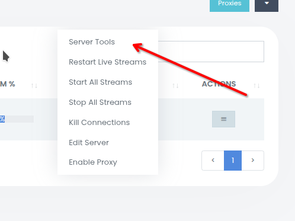

# Документация по обновлению панели управления

Эта документация описывает процесс обновления XC_VM. Следуйте инструкциям ниже, чтобы успешно обновить сервер через панель управления.

## Предварительные требования
- Доступ к панели управления с соответствующими правами администратора.
- Стабильное интернет-соединение.
- Резервная копия данных сервера (рекомендуется перед обновлением).

## Пошаговая инструкция

1. **Перейдите в раздел "Servers"**
   - Войдите в панель управления.
   - В главном меню выберите раздел **Servers**.
   - 

2. **Выберите "Manage Servers"**
   - В разделе "Servers" найдите и нажмите на **Manage Servers**, чтобы просмотреть список доступных серверов.
   - 

3. **Откройте меню "Actions"**
   - Найдите сервер, который требуется обновить, в списке.
   - Нажмите на кнопку **Actions** (обычно представлена в виде выпадающего меню или значка рядом с сервером).
   - 

4. **Перейдите в "Server Tools"**
   - В меню "Actions" выберите **Server Tools**, чтобы открыть доступные инструменты для управления сервером.
   - 

5. **Запустите "Update Server"**
   - В разделе "Server Tools" выберите опцию **Update Server**.
   - Подтвердите действие, если появится запрос (может потребоваться ввести пароль или подтвердить обновление).
   - Дождитесь завершения процесса обновления. Не прерывайте процесс, чтобы избежать ошибок.
   - 

## Примечания
- **Время обновления**: Время, необходимое для обновления, зависит от размера сервера и скорости интернет-соединения.
- **Проверка обновления**: После завершения обновления проверьте статус сервера, чтобы убедиться, что он работает корректно.
- **Ошибки**: Если обновление завершилось с ошибкой, проверьте логи сервера или обратитесь в техническую поддержку.

---

**Примечание**: Пожалуйста, прикрепите изображения для каждого шага, чтобы они были включены в документацию. Если изображения еще не предоставлены, укажите, где они должны быть вставлены, как показано выше.