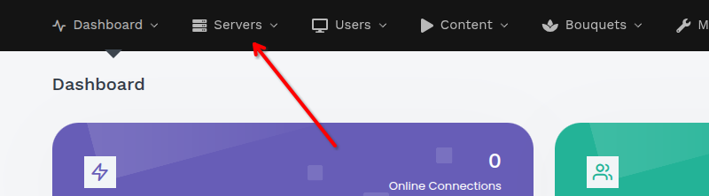
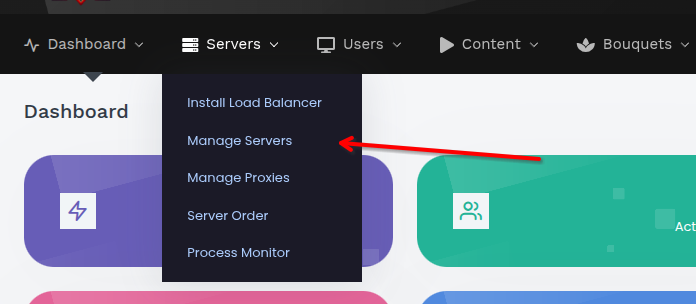
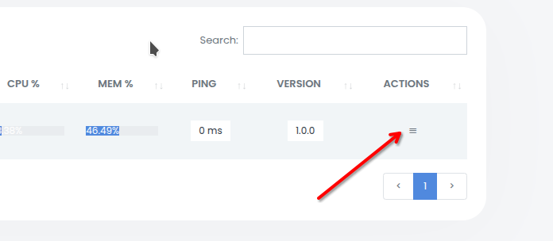
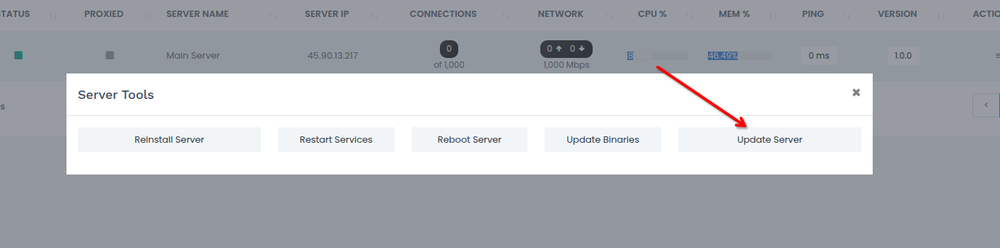

<h1 align="center">🧩 Руководство по обновлению через панель управления</h1>

  В этом документе описан процесс обновления <b>XC_VM</b> через веб-панель управления. 
  Следуйте шагам ниже, чтобы выполнить обновление безопасно и корректно.

---

## ⚙️ Перед началом

Перед тем как начать обновление, убедитесь, что у вас есть:

- 🔑 **Доступ администратора** к панели управления.  
- 🌐 **Стабильное интернет-соединение**.  
- 💾 **Резервная копия данных сервера** *(настоятельно рекомендуется)*.

---

## 🪜 Пошаговая инструкция

### 1️⃣ Перейдите в раздел **“Servers”**
- Авторизуйтесь в панели управления.  
- Выберите раздел **Servers** в главном меню.  
  

---

### 2️⃣ Выберите **“Manage Servers”**
- В разделе **Servers** нажмите **Manage Servers**, чтобы открыть список доступных серверов.  
  

---

### 3️⃣ Откройте меню **“Actions”**
- Найдите сервер, который требуется обновить.  
- Нажмите кнопку **Actions** — обычно это выпадающее меню или значок рядом с сервером.  
  

---

### 4️⃣ Перейдите в раздел **“Server Tools”**
- В меню **Actions** выберите пункт **Server Tools**, чтобы открыть инструменты управления сервером.  
  

---

### 5️⃣ Запустите **“Update Server”**
- В разделе **Server Tools** нажмите **Update Server**.  
- Подтвердите действие, если потребуется (возможно, будет запрошен пароль).  
- Дождитесь завершения обновления — **не прерывайте процесс**, чтобы избежать ошибок.  
  

---

## 🧠 Примечания и рекомендации

> 🕒 **Время обновления**  
> Зависит от размера сервера и скорости интернет-соединения.

> ✅ **Проверка после обновления**  
> После завершения обновления проверьте состояние сервера и убедитесь, что все службы работают корректно.

> ⚠️ **Ошибки при обновлении**  
> В случае ошибки проверьте логи сервера или обратитесь в техническую поддержку.

---

<!-- 

  <a href="../"><b>⬅️ Назад к Wiki</b></a> 

--- -->
